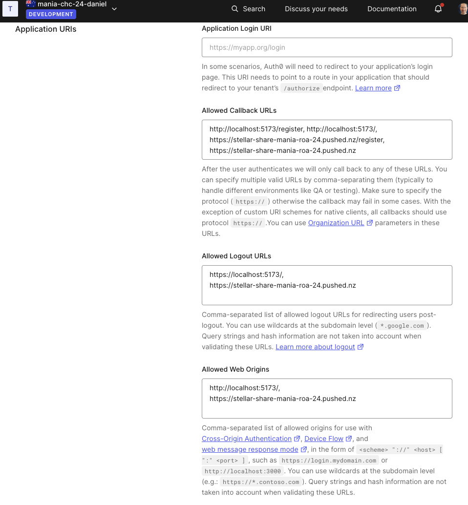

# Boilerplate: Fullstack with ~~Sass~~ Tailwind

## Setup

### What's included

This repo includes:

* a single, simple API endpoint (`/api/v1/fruits`)
* a single React component (`<App />`)
* an example database module (`server/db/fruits.js`)
* an API client module (`client/apis/fruits.js`)
* configuration for Vitest and testing library
* configuration for server-side debugging in VS Code
* configuration for ~~preprocessing Sass~~ [Tailwind](https://tailwindui.com/)

### Installation

#### **From the Github UI**

See the instructions [here](https://docs.github.com/en/free-pro-team@latest/github/creating-cloning-and-archiving-repositories/creating-a-repository-from-a-template) to use Github's feature to create a new repo from a template.

#### **From the command line**

```
git clone https://github.com/dev-academy-challenges/boilerplate-fullstack [your-project-name]
cd [your-project-name]
npm install # to install dependencies
npm run dev # to start the dev server
```

You can find the server running on [http://localhost:3000](http://localhost:3000) and the client running on [http://localhost:5173](http://localhost:5173).

### Deployment to Dokku
**Final project should be deployed to: '.pushed.nz'**
This server is just for final group projects.

To use **pushed.nz** all you need to edit is your `~/.zshrc` (open with `code ~/.zshrc`) to replace:
`export DOKKU_HOST='devacademy.nz'`

with:
`export DOKKU_HOST='pushed.nz'`

and then make sure the config is reloaded, either by opening a new terminal or by running:
`source ~/.zshrc`

Now you can follow the [Deploying a full-stack web app with a database](https://student-handbook.devacademy.life/guides/deploying/4-deploying-a-fullstack-web-app-with-a-database) guide to deploy!

As we are using **Auth0** for authenticating users, we need to update also our [Application URIs](https://manage.auth0.com/dashboard/au/mania-chc-24-daniel/applications/jF4daF0zuwiJKvVe07bZmGdUkZrntP0X/settings)
* Update **Allowed Callback URLs** on the Auth0 App like this:
  ```
  http://localhost:5173/register,
  http://localhost:5173/,
  https://stellar-share-mania-roa-24.pushed.nz:5173/register,
  https://stellar-share-mania-roa-24.pushed.nz:5173/
  ```
* Same for **Allowed Logout URLs**:
  ```
  http://localhost:5173/,
  https://stellar-share-mania-roa-24.pushed.nz:5173/
  ```
* and same for **Allowed Web Origins**
  ```
  http://localhost:5173/,
  https://stellar-share-mania-roa-24.pushed.nz:5173/
  ```

<figure>
<figcaption>As visible on the figure of Auth0 Application URIs below:</figcaption>

</figure>

---
[Provide feedback on this repo](https://docs.google.com/forms/d/e/1FAIpQLSfw4FGdWkLwMLlUaNQ8FtP2CTJdGDUv6Xoxrh19zIrJSkvT4Q/viewform?usp=pp_url&entry.1958421517=boilerplate-fullstack)
